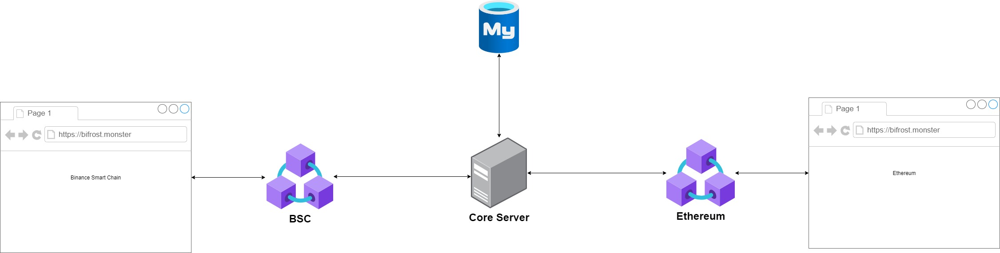
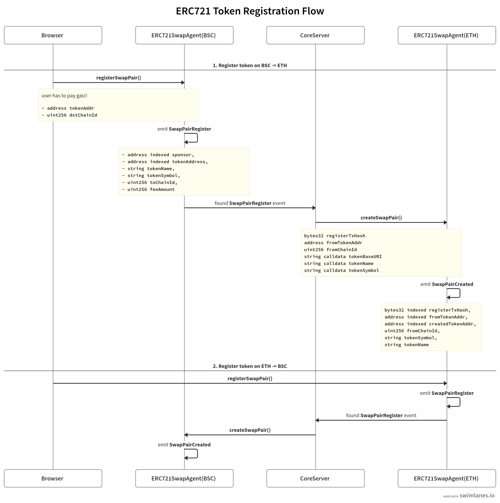
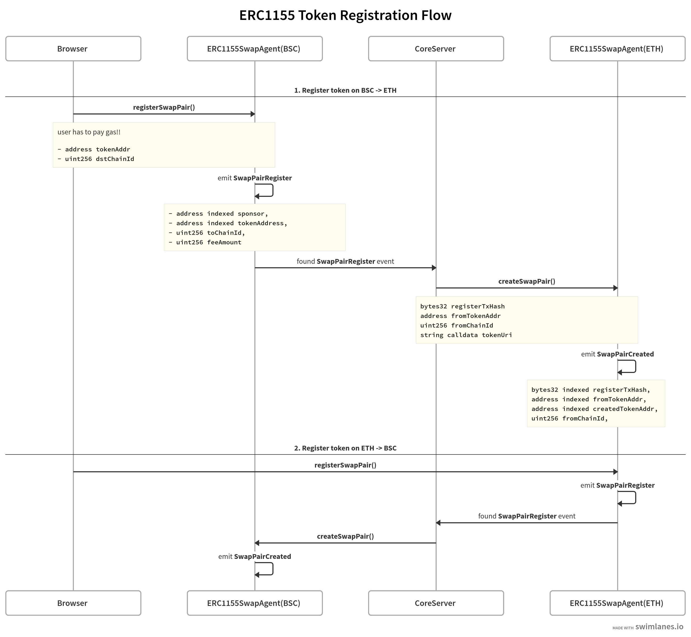
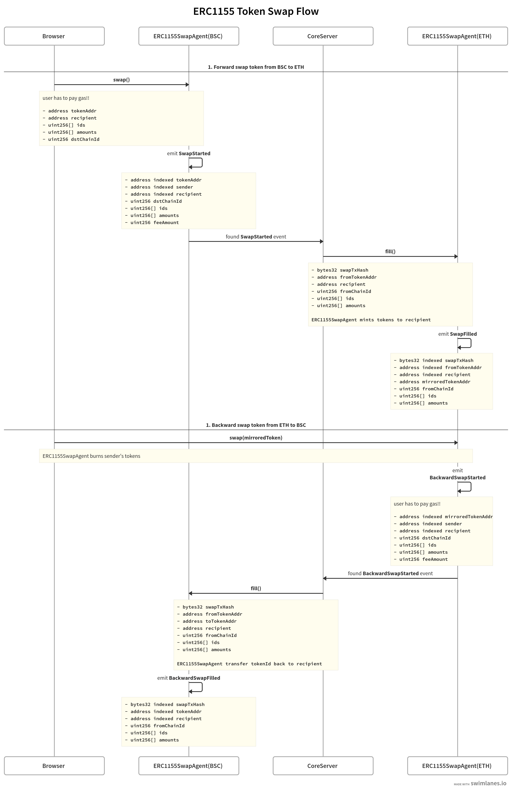

# bsc-evm-compatible-bridge

**README WILL BE UPDATED LATER**

There are 4 repositories
- https://github.com/synycboom/bsc-evm-compatible-bridge-api
- https://github.com/synycboom/bsc-evm-compatible-bridge-contract
- https://github.com/synycboom/bsc-evm-compatible-bridge-core
- https://github.com/synycboom/bsc-evm-compatible-bridge-app

### DEMO
- https://youtu.be/C8HMUdBe8w0
- https://youtu.be/YKeRaXvzGOo

### Architecture

### ERC721 Token Registration Flow

### ERC721 Token Swap Flow

### ERC1155 Token Registration Flow

### ERC1155 Token Swap Flow

